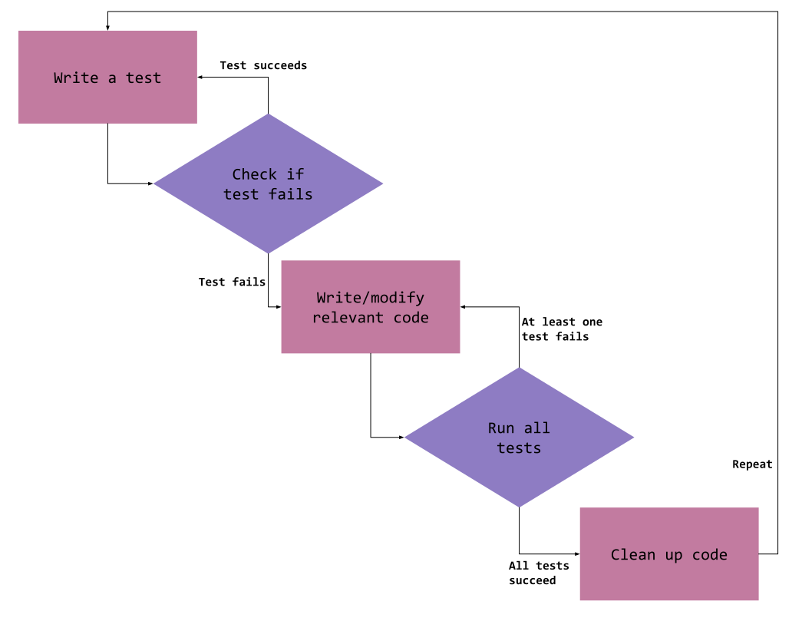

# C++ Exercise - Hangman TDD

## TDD

Test Driven Development (TDD) is a software development practice that focuses on understanding the software requirements before writing the relevant code. It also emphasizes writing tests, specifically unit tests which are important for any software project, particularly larger software systems with multiple contributors that will be used by end-users that expect it to satisfy certain requirments.

The process for employing TDD is as follows:

1. Write a test based on requirements for the project feature. The actual coding implementation of this feature should not be implemented yet. The test should pass if, and only if, the new feature is implemented correctly.
2. Ensure that the test fails, since the feature does not exist yet. This ensures the test is not flawed to always pass.
3. Write the simplest code to pass the test. Rough code is acceptable for now as long as the requirements are satisfied.
4. Re-run all tests to ensure they all pass.
5. Refactor and clean up code to ensure code is maintainable and readable still. Ensure all tests still pass after this step.
6. Repeat this process with the next feature!

This technique is used to fix bugs, not just add new features. Treat a bug fix as if it is addding a new feature, that feature just happens to restore the program to its expected behavior.



## Unit testing

 Unit testing is a method of software testing where individual 'units' of source code are tested to ensure they satisfy project requirements. Units are loosely defined as "sets of one or more computer program modules together with associated control data, usage procedures, and operating procedures". When unit testing, you should always try to test the smallest functional piece of code you can, breaking the requirements into as many meaningful units as possible.

Unit testing is one of the most popular testing methods implemented directly by the development team because its relatively easy to tie into existing source code and is beneficial towards detecting bugs early in the development cycle. Unit tests also serve as 'living documentation' of a system, as all of the project specifications should be laid out in code through the unit tests, and must remain up to date to ensure all of the tests pass.

## Example output

```txt

Attempt: _ _ _ _ _
Dead letters:
Guess a letter: a
  _
 / \
 \ /
  |
Attempt: _ _ _ _ _
Dead letters: a
Guess a letter: t
  _
 / \
 \ /
  |
Attempt: t _ _ t _
Dead letters: a
Guess a letter: b
  _
 / \
 \ /
  |
  |
  |
Attempt: t _ _ t _
Dead letters: a b
Guess a letter: e
  _
 / \
 \ /
  |
  |
  |
Attempt: t e _ t _
Dead letters: a b
Guess a letter: c
  _
 / \
 \ /
  |
/-|
  |
Attempt: t e _ t _
Dead letters: a b c
Guess a letter: s
  _
 / \
 \ /
  |
/-|
  |
Attempt: t e s t _
Dead letters: a b c
Guess a letter: d
  _
 / \
 \ /
  |
/-|-\
  |
Attempt: t e s t _
Dead letters: a b c d
Guess a letter: g
  _
 / \
 \ /
  |
/-|-\
  |
 /
Attempt: t e s t _
Dead letters: a b c d g
Guess a letter: 2
You win!
Solution: test2
```

## Compiling

Compiling is covered in depth in [Learncpp Chapter 0.7](https://www.learncpp.com/cpp-tutorial/compiling-your-first-program/), but a brief example for **Linux** is as follows:

### Install

```console
$ sudo apt install g++
```

### Compile

```console
$ g++ -o assignment assignment.cpp
```

### Execute

```console
$ ./assignment
```
